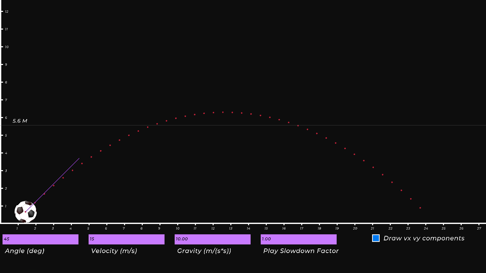
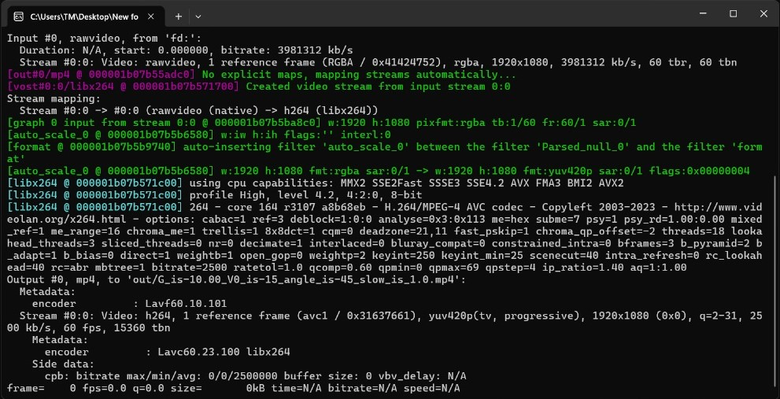
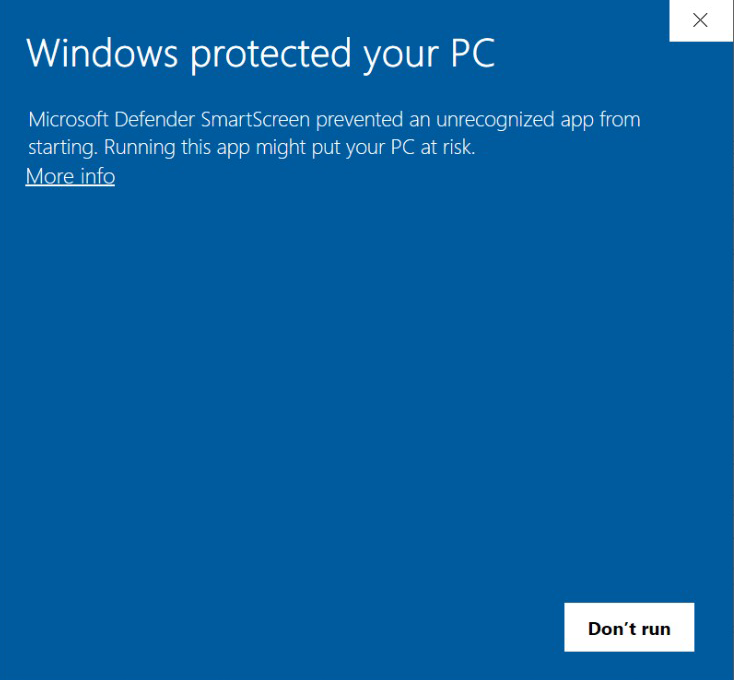

# Projectile motion simulator

<p align=center>
  
</p>

> [!WARNING]
> This software is unfinished. Keep your expectations low.

## Usage
This app is disigned to generate HD(1920x1080) videos that simulates the motion of Projectile
</br>
this is video showes how it looks like
</br>
</br>


https://github.com/user-attachments/assets/fcd1e023-c14a-4a7f-8d50-b100a7c45abe


## How to use it
### Textboxes
You can enter the values you want in textbox there are 4 textboxes

<ol>
    <li> 
        <strong>Angle</strong>
        : this takes intger value like( 1 , 2 ,3 ) only , (1.1 , 0.3) are not allowed
     </li>
    <li>
        <strong>Velocity</strong>: 
        The values as same as Anlge
    </li>
    <li>
        <strong>Gravity</strong>:
        Takes float values like (9.9 , 8.5)
    </li>
    <li>
        <strong>Slowdown</strong>:
        Takes values like Gravity , this value slow down the time , the value 1 does no effict , the value 2 will slowdown the time by 2 and so on .... ,
    </li>
    
</ol>

### Checkboxes
There is one chackbox for now it for drawing Velocity compontets all video time if you un check it the components will be drown on the max height the ball will reatch only
### keyboard
<ol>
    <li>
        <code>ESC</code> This key is specialized to exit from program
    </li>
    <li>
        <code>Space</code> This key is specialized to preview the ball path  
    </li>
    <li>
        <code>Ctrl + R</code> This two keys are specialized to render the final vidoe 
    </li>
    <li>
        <code>F</code> This key is specialized to go full screen  
    </li>
    
</ol>

## Render
The final video is rendered using [FFMPEG](https://www.ffmpeg.org/about.html)</br>
So don't worry about this window


## Download 
### Windows (64 bit)
you can download it from here [Projectile motion simulator ](#)
</br>
**Please you need trust me when this warning appears** </br></br>
</br>

This project is fully open source and safe

### Linux soon

## Build
### for linux
To build this project you have to [install raylib](https://github.com/raysan5/raylib/wiki/Working-on-GNU-Linux) first </br>
Then you can run this command 
```bash
gcc -o PMS main.c movement/movement.c movement/physics/engine.c helper.c objs/ball.c objs/values_board.c controles/text_box.c controles/controles.c objs/angle_arrow.c movement/timer.c movement/queue/queue.c ffmpeg_windows.c controles/checkbox.c -lraylib -lGL -lm -lpthread -ldl -lrt -lX11
```
**You also need to download FFMPEG**
```
sudo apt install ffmpeg         [On Debian, Ubuntu and Mint]
sudo yum install ffmpeg         [On RHEL/CentOS/Fedora and Rocky/AlmaLinux]
sudo emerge -a sys-apps/ffmpeg  [On Gentoo Linux]
sudo apk add ffmpeg             [On Alpine Linux]
sudo pacman -S ffmpeg           [On Arch Linux]
sudo zypper install ffmpeg      [On OpenSUSE]    
sudo pkg install ffmpeg         [On FreeBSD]
```
**NOTE: Makefile doesn't work yet**
### Windows soon

## Feedback
Email : ahmnaib11@gmail.com
LinkedIn: https://www.linkedin.com/in/ahmniab/
